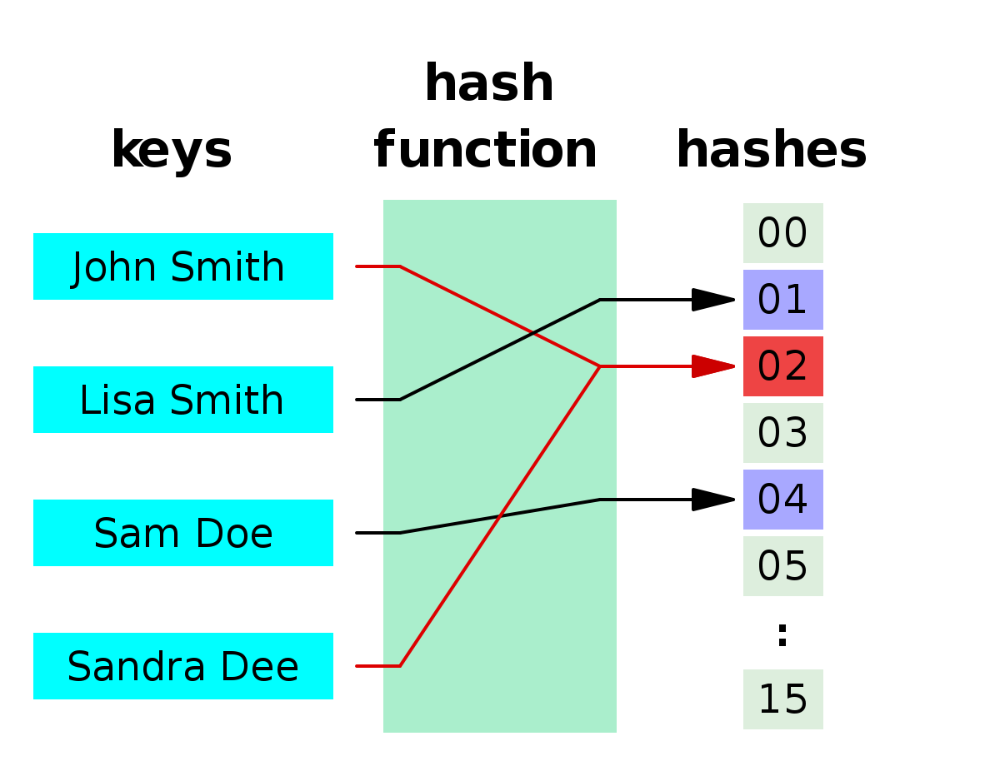
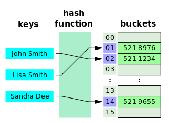

# 정적 멤버와 static

- 정적 멤버란 클래스의 고정된 멤버로써 **객체를 생성하지 않고**사용 할 수 있는 필드와 메서드(클래스 멤버라고도 한다)

## static 멤버 선언

- static 키워드를 붙여 줌으로써 정적 멤버를 선언

```
    public class StaticTest{
         // 최초 1회만 메모리 할당을 받고 모든 객체들이 공유함
         public static int b = 0;
        // 정적 메서드 선언
        static int pius(int x, int y) {
            return x+y;
        }
         //인스턴스 변수
         private int a = 0;
     }
```

- 정적 필드와 메서드는 클래스에 고정된 멤버이므로 클래스 로딩이 끝나면 바로 사용이 가능
- 인스턴스로 필드로 선언 할 지 static 필드로 선언 할 지의 판단 기준

  - 객체마다 각각 가져야 하는 데이터 => 인스턴스 필드로 선언
  - 공용적인 데이터 => static 으로 선언

- 인스턴스로 메서드로 선언 할 지 static 메서드로 선언 할 지의 판단 기준
  - 인스턴스 필드를 사용하는 경우 => 인스턴스 메서드로 사용
  - 인스턴스 필드를 사용하지 않는 경우 => static 메서드로 사용

```
    public class Calculator {
        String color;
        void setColor(String color) { this.color = color }// 인스턴스 필드 사용, 인스턴스 메서드
        // 정적 메서드
        static int pius(int x, int y) {
            return x+y;
        }
    }
```

- 정적요소의 접근은 클래스로 하는것을 권장 한다

```
    class ScjpPass{
    //멤버 변수, Heap
    int t1=0;
    int t2=0;
    int t3=0;
    int t4=0;

    //클래스 변수, Data area
    static int BONUS=100;

    //생성자, Source area
    public ScjpPass(){
    }

    //생성자, this = sp객체가 가지고 있는 hash code
    //sp객체의 heap메모리를 공유하게됩니다.
    //int t1, int t2, int t3, int t4: Stack
    public ScjpPass(int t1, int t2, int t3, int t4){
        //Heap = Stack
        //전역 변수 = 지역 변수
        //멤버 변수 = 지역 변수
        this.t1 = t1;
        this.t2 = t2;
        this.t3 = t3;
        this.t4 = t4;
    }

}


public class Scjp {
    public static void main(String[] args) {
        System.out.println("ScjpPass.BONUS: " + ScjpPass.BONUS);

        //t1은 static이 아님으로 클래스명으로 접근 할 수 없습니다.
        //System.out.println(ScjpPass.t1);
        //heap memory 할당
        ScjpPass sp = new ScjpPass(85, 90, 80, 70);
        System.out.println("sp.t1: " + sp.t1);
        //static변수는 클래스명으로 접근을 권장합니다.
        //System.out.println("sp.BONUS: " + sp.BONUS);
    }
}

```

## 정적 초기화 블록

- 계산이 필요한 복잡한 정적필드의 초기화시 static block 을 통해 초기화 한다
- static block은 클래스 로딩시 자동 실행되고 클래스 내에 여러개가 선언 가능

```
public class StaticBlock {
    static String company = "Samsung";
    static String model = "LEDTV";
    static String TV;
    static {
        TV = company + model;
    }

}
```

## 정적 메서드와 블록선언 시 주의점

- static 메서드나 블록은 객체가 없이도 실행 가능 => 인스턴스 필드나 메서드, this 키워드 사용X
- static block에서 인스턴스 멤버를 쓰고 싶을 땐 객체를 먼저 생성 후 참조 변수로 접근해야한다
- main() 메서드 또한 static이므로 인스턴스 메서드를 바로 사용 할 수 없다

```
public class Car {
    int speed;

    void run(){
        System.out.println("지금 차량의 속도:"+speed);
    }
    public static void main(String[] args) {
        Car myCar = new Car();
        myCar.speed = 60;
        myCar.run();
    }
}

```

## 싱글톤(Singleton)

- 전채 프로그램중 **단 하나만** 만들수 있도록 보장된 객체
- 만드는 법
  1. 생성자를 외부에서 호출 할 수 없도록 private 접근 제한자를 붙여준다
  2. 자신의 타입인 정적 필드를 선언하고 자신의 객체를 생성하여 초기화
  3. 정적 메서드인 getInstance()를 선언하여 정적 필드에서 참고하고 있는 자신의 객체를 리턴

```public class Singleton {
    //자신의 타입인 정적 필드를 선언하고 자신의 객체를 생성하여 초기화
    private static Singleton instance = new Singleton();

    private Singleton() {
        // 생성자는 외부에서 호출못하게 private 으로 지정해야 한다.
    }

    //정적 메서드인 getInstance()를 선언하여 정적 필드에서 참고하고 있는 자신의 객체를 리턴
    public static Singleton getInstance() {
        return instance;
    }

}
```

## 싱글톤 패턴의 사용하는 이유

- 최초 한번의 new 연산자를 통해서 고정된 메모리 영역을 사용하기 때문에 추후 해당 객체에 접근할 때 메모리 낭비를 방지할 수 있다.
- 다른 클래스 간에 데이터 공유가 쉽다.
- 싱글톤 인스턴스가 전역으로 사용되는 인스턴스이기 때문에 다른 클래스의 인스턴스들이 접근하여 사용할 수 있다.
- 도메인 관점에서 인스턴스가 한 개만 존재하는 것을 보증하고 싶은 경우 싱글톤 패턴을 사용하기도 한다.

- 위의 코드는 멀티 스레드 환경에서 Thread-Safe 를 보장해주지 않는다.
- 두 개의 스레드에서 동시에 getInstance() 를 호출 한경우 에 if (instance == null) 조건문에 동시에 도달하게 되어 instance 를 두번 생성할 수 도 있기 떄문!
- 이를 해결하기 위해, Java 에서 스레드 동기화를 지원하는 Synchronzied 를 사용할 수 있다.

```
public class Singleton {
    private static Singleton instance;

    private Singleton() {}

    // synchronzied 스레드 동기화를 사용하며 멀티 스레드 환경에서의 동시성 문제 해결
    public static synchronzied Singleton getInstance() {
      if(instance  == null) {
         instance  = new Singleton();
      }
      return instance;
    }
}
```

## final

값을 변경할 수 없는 final 변수(상수 선언)

- 값을 변경할 수가 없습니다.

- 값을 고정할 필요가 있는 코드와 같은 형태의 데이터에 사용합니다.

```
값을 변경할 수 없는 final 변수(상수 선언)
   - 값을 변경할 수가 없습니다.

   - 값을 고정할 필요가 있는 코드와 같은 형태의 데이터에 사용합니다.
     예)1년 12달, 요일, 주7일


>>>>> Finalmain.java

class Final{
    int money = 10000;  //인스턴스 변수

    //값을 변경 할 수 없습니다.
    final int day = 7;  //1주, final 인스턴스 변수
    final int week = 4; //한달, final 인스턴스 변수

    //객체를 만들지 않아도 사용할 수 있습니다.
    //final static 변수
    final static int month = 12; //1년

    //생성자가 존재 하지만 아무런 처리를 하지 않습니다.
    public Final(){}
}

public class Finalmain {

    public static void main(String[] args) {
        Final fi = new Final();
        fi.money = 15000;
        //final변수는 값을 변경(대입)할 수 없습니다.
        //fi.day = 10;
        System.out.println("1주일 용돈:" + fi.money * fi.day);
        System.out.println("1년" + Final.month + "달");
        //Final.month = 20000;
    }
}

```

# Interface
## 타입변환과 다형성
### **다형성** 이란?
다형성은 하나의 타입에 대입되는 객체에 따라 실행 결과가 
다양한 형태로 나오는 것을 말한다

즉 상속관계에 있는 클래스에서 상위클래스가 동일한 메세지로 하위클래스를 다르게
동작 시키고자하는 객체지향의 원리이다.

최근엔 상속보다도 인터페이스를 활용 하여 다형성을 구현하는데
그이유는 인터페이스를 상속하게 되면 인터페이스의 추상 메서드를 반드시
구현 해야 함으로 물리적으로 다형성을 100% 보장하기 때문일 것이다


```
package kr.poly;
public interface class Animal{ 
	// Dog, Cat -->eat()
	public void eat(); // 추상메서드=>불완전한메서드,장애메서드

}
```
```
package kr.poly;
public class Cat implements Animal{
  
	@Override
	public void eat() {
		System.out.println("고양이 처럼 먹다.");
	}  
}
```
```

package kr.poly;
public class Dog implements Animal{ 

 
  public Dog() {
	  super();//new Animal();
  }
	@Override
	public void eat() {
		System.out.println("개처럼 먹다.");
	}   
}
```
```

import kr.tpc.Animal;
import kr.tpc.Cat;
import kr.tpc.Dog;
public class TPC20 {
	public static void main(String[] args) {
     // Animal 부모클래스를 사용하지 않음
	 Dog d=new Dog();
	 d.eat(); // ? -> 개처럼먹다.

	 Cat c=new Cat();
	 c.eat();
	
	 // 동일한 메세지로 서로 다른걸 구현
	 // Dog.class, Cat.class
	 Animal ani=new Dog(); // upcasting(자동형변환)
	 ani.eat(); // ? -> 개처럼먹다.
	 
	 ani=new Cat();
	 ani.eat(); // ? -> 고양이 처럼먹다.
	 //ani.night();
	}
}
```
위의 예시를 보면 **Animal** 이라는 인터페이스를 통해 다른 동작을 하는
하위 객체인 **Cat** 과 **Dog**을 같은 타입으로서 쓸 수 있다

```
import kr.tpc.*;
public class TPC24 {
	public static void main(String[] args) {
      // 2. 다형성 배열
	  // Dog, Cat 저장할 배열을 생성하시오?		
      Animal[] ani=new Animal[2];
      ani[0]=new Dog();
      ani[1]=new Cat();
      }
      }
```
서로다른 객체를 인터페이스를 활용 함으로써 하나의 배열안에 넣어서 쓸 수 있다
```
>>> TV.java
package polymorphism;
 
public interface Rmocon {
   void powerOn() ;
   void powerOff();
   void volumeUp();
   void volumeDown();
}

>>> SamsunTV.java
package polymorphism;
 
public class SamsungTV implements Remocon {
 
  public void powerOn() {
    System.out.println("SamsungTV.....전원 켠다.");
  }
 
  public void powerOff() {
    System.out.println("SamsungTV.....전원 끈다.");
  }
 
  public void volumeUp() {
    System.out.println("SamsungTV.....소리 올린다.");
  }
 
  public void volumeDown() {
    System.out.println("SamsungTV.....소리 내린다.");
  }
}

>>> LgTV.java
package polymorphism;
 
public class LgTV implements Remocon {
 
  public void powerOn() {
    System.out.println("LgTV.....전원 켠다.");
  }
 
  public void powerOff() {
    System.out.println("LgTV.....전원 끈다.");
  }
 
  public void volumeUp() {
    System.out.println("LgTV.....소리 올린다.");
  }
 
  public void volumeDown() {
    System.out.println("LgTV.....소리 내린다.");
  }
 
}

>>>TVUser.java
package polymorphism;
 
public class TVUser {
 
  public static void main(String[] args) {
    Remocon remocon = new SamsungTV();
    tv.powerOn();
    tv.powerOff();
    tv.volumeUp();
    tv.volumeDown();
 
    Remocon remocon2 = new LgTV();
    tv2.powerOn();
    tv2.powerOff();
    tv2.volumeUp();
    tv2.volumeDown();
  }
}
 
- TVUser 클래스는 Remocon 인터페이스를 통해 각 LgTV, SamsungTV가 어떻게 구현이 되어있는지 몰라도 
사용 할 수 있다
```

## 다형성을 이용한 프로그래밍의 예

### 1. JDBC
- JDBC란 자바프로그램이 데이터베이스와 연결되어 데이터를 주고 받을 수 있도록 해주는 프로그래밍 인터페이스이다
- 자바에서 JDBC프로그래밍을 하기위해선 각 DB의 벤더(Oracle, MariaDB ...)들이 제공해주는 통일된 클래스가 있어야한다
만일 그렇지 않다면 벤더별로 CRUD의 동작법이 다르므로 자바개발자가 각DB의 동작방법을 알아야한다 => 즉 불가능하다는 이야기!!
- 즉 인터페이스로 각 클래스가 **구현** 할 **역할**을 알려주고 실제 구현은 각 벤더사에게 맡긴다면 개발자는 각 DB의 설계를 알지
못하더라도 DB를 통한 프로그래임이 가능하다!! 


출처 : http://lupin204.tistory.com/49


### 2.bbs

```
package com.study.model;

import java.util.List;
import java.util.Map;

public interface BbsService {
  List<BbsDTO> list(Map map);
  int total(Map map);
  void upViewcnt(int bbsno);
  BbsDTO read(int bbsno);
  int create(BbsDTO dto);
  int passCheck(Map map);
  int update(BbsDTO dto);
  int delete(int bbsno);
  BbsDTO readReply(int bbsno);
  void upAnsnum(Map map);
  int createReply(BbsDTO dto);
  
}

```
```
package com.study.model;

import java.util.List;
import java.util.Map;

import org.springframework.beans.factory.annotation.Autowired;
import org.springframework.stereotype.Service;
@Service("com.study.model.BbsServiceImpl")
public class BbsServiceImpl implements BbsService {
  @Autowired
  private BbsMapper mapper;
  
  public List<BbsDTO> list(Map map) {
    
    return mapper.list(map);
  }
  @Override
  public int total(Map map) {
    
    return mapper.total(map);
  }
  @Override
  public void upViewcnt(int bbsno) {
    
    mapper.upViewcnt(bbsno);
  }....
```

```
public class BbsController {
//  @Autowired
//  private BbsDAO dao; //마이바티스없이할때
  
  @Autowired
  @Qualifier("com.study.model.BbsServiceImpl") //BbsServiceImpl @Service에 객체생성할때 지정된이름
  private BbsService dao;
  
  @GetMapping("/bbs/reply/{bbsno}")
  
  public String reply(@PathVariable int bbsno, Model model) {
    model.addAttribute("dto", dao.readReply(bbsno));    
    return "/reply";
  }
  @PostMapping("/bbs/reply")
  public String reply(BbsDTO dto) {
    Map map = new HashMap();
    
    map.put("grpno",dto.getGrpno());
    map.put("ansnum",dto.getAnsnum());
    dao.upAnsnum(map);
    
    if(dao.createReply(dto) == 1) {//dao.createReply(dto)
      return "redirect:list";
    }else {
      return "error";
    }
  }...
```
- 위와 갘이 프로그래밍을 하였을때
만일 쓰고 있는 DB가 바뀐다고 하더라도 BbsService의 역할은 똑같으므로
DB에따라 구현만(BbsServiceImpl)다시 해주면 된다

## default메소드
인터페이스가 default키워드로 선언되면 메소드가 구현될 수 있다. 또한 이를 구현하는 클래스는 default메소드를 오버라이딩 할 수 있다.
```
    public interface Calculator {
        public int plus(int i, int j);
        public int multiple(int i, int j);
        default int exec(int i, int j){      //default로 선언함으로 메소드를 구현할 수 있다.
            return i + j;
        }
    }

    //Calculator인터페이스를 구현한 MyCalculator클래스
    public class MyCalculator implements Calculator {

        @Override
        public int plus(int i, int j) {
            return i + j;
        }

        @Override
        public int multiple(int i, int j) {
            return i * j;
        }
    }

    public class MyCalculatorExam {
        public static void main(String[] args){
            Calculator cal = new MyCalculator();
            int value = cal.exec(5, 10);
            System.out.println(value);
        }
    }
    ```
인터페이스가 변경이 되면, 인터페이스를 구현하는 모든 클래스들이 해당 메소드를 구현해야 하는 문제가 있다. 이런 문제를 해결하기 위하여 인터페이스에 메소드를 구현해 놓을 수 있도록 하였다.

클래스, 객체는 참조형으로 데이터
메서드 내에 선언된 변수 = 지역 변수

String은 참조형 => 변수를 사용하여 메서드르르 사용할 수 있다
break=> 반복문이나 스위치 문에서 나올때만 쓰임
stack => 지역변수(메모리에 올라오면 사용되고 자동 삭제)
heap => 객체, 배열(쓰여지지 않을때만 갈비지 컬렉터가 삭제), 자동 초기화가 된다

for문의 break  
 - 반복문을 완전히 빠져 나갈 때 사용 
 - break문은 하나의 반복문만 벗어남 
 - 중첩 반복의 경우 안쪽 반복문이 break 문을 포함하고 있으면 안쪽 반복문만 벗어남 

지역변수에 배열 할당
지역변수에 다른값이 들어가 힙에 있는 데이터와 완전히 연결이 끊어지면 그떄 힙의 데이터가 덩그러니 남겨짐
이떄 갈비지 컬렉터가 힙의 데이터를 지운다

자바는 객체를 사용 해야지만 사용 할 수 있는 메서드가 있고 객체 생성을 사용하지 않고
클래스 네임으로만 사용 할 수 있는 메서드가 있다 

## 람다식
 함수형 인터페이스

- 람다식 구현을 위해 함수형 인터페이스를 만들고, 인터페이스에 람다식 메서드를 대입한다.
- 람다식은 하나의 메서드를 구현하여 인터페이스형 변수에 대입된다.
- 함수형 인터페이스는 두 개 이상의 메서드를 가질 수 없다.

### @FunctionalInterface 애노테이션

- 실수로 메서드를 하나 이상 선언하면 오류가 나도록 한다.
- 함수형 인터페이스를 명시적으로 표현한다.
- 애노테이션을 생략해도 된다.

package lambda;
```
@FunctionalInterface
public interface MyNumber {

    int getMax(int num1, int num2);

    int getAdd(int num1, int num2);

}
```

### 매개변수가 있는 함수

익명함수를 지칭하는 용어.

- 함수 생성의 단축형
- 여러 줄의 코드를 가질 수 있다.

//리턴이 없는 경우
```
(매개변수)->{중괄호 실행};
```

```java
// 매개변수가 여러개인 경우
(매개변수1, 매개변수2) -> {
  //로직
  return ..;
}

----------------------------------------------------------------
// 매개변수가 1개 & return 값만 있는 경우
매개변수 -> ""
```

매개변수로서 함수
>
```
private static void printBasic(List<String> list) {
        for (String string : list) {
            System.out.println(string);
        }
    }
```
```
private static void printWithFP(List<String> list) {
        list.stream().forEach( 
                element -> System.out.println(element) // 람다식
        );
    }
```
위 두 메소드는 같은 결과를 도출한다.
- stream은 값의 흐름(list 안의 원소들)
- foreach는 stream에서 데이터가 아닌 흐름의 각 요소마다 실행될 함수를 보내는 것
- () -> => 람다식 (불필요한 코드를 줄이고, 가독성을 높임)
- element에 list안의 원소들이 들어가고 System.out.println(element)에서 시행

클래스 멤버와 로컬 변수 사용
람다식 실행블록에는 클래스 멤버와 로컬 변수를 사용할 수 있다.
클래스의 멤버 사용
일반적으로 익명객체에 사용되는 this는 익명객체의 참조이지만, 람다식에서 this는 내부적으로 생성되는 익명 객체의 참조가 아니라 람다식을 실행한 객체의 참조이다.
this 사용 예제
```
public class UsingThis {
    public int outterValue = 10;

    class Inner{
        int innerValue = 20;

        void method(){
            MyFunctionalInterface fi = () -> {
                int innerValue = 40;
                System.out.println("outterValue : " + outterValue);
                System.out.println("outterValue : " + UsingThis.this.outterValue + "\n");

                System.out.println("innerValue : " + innerValue);
                System.out.println("innerValue : " + this.innerValue + "\n"); // 람다식 내부에서 this는 Inner 객체를 참조
            };
            fi.method();
        }
    }
}public class UsingThisExample {
    public static void main(String[] args) {
        UsingThis usingThis = new UsingThis();
        UsingThis.Inner inner = usingThis.new Inner();
        inner.method();
    }
}
```
outterValue : 10
outterValue : 10
innerValue : 40
innerValue : 20

로컬 변수 사용
람다식에서 바깥 클래스의 필드나 메소드는 제한 없이 사용할 수 있으나, 메소드의 매개 변수 또는 로컬 변수를 사용하면 이 두 변수는 final 특성을 가져야 한다. 따라서 매개 변수 또는 로컬 변수를 람다식에서 읽는 것은 허용되지만, 람다식 내부 또는 외부에서 변경할 수 없다.
```
public class UsingLocalVariable {
    void method(int arg){
        int localVar = 40;

        MyFunctionalInterface fi = () -> {
            // 로컬 변수 읽기
            System.out.println("arg : " + arg);
            System.out.println("localVar : " + localVar + "\n");
            // localVar = localVar + 1; // 불가
        };

        fi.method();
    }
}public class UsingLocalVariableExample {
    public static void main(String[] args) {
        UsingLocalVariable ulv = new UsingLocalVariable();
        ulv.method(20);
    }
}
```
출처: https://cornswrold.tistory.com/237 [평범한개발자노트:티스토리]

## Set Collection
### Set의 특징
- 값의 저장 순서가 없다
- 값의 중복 저장이 허용되지 않는다
- 즉 **집합**을 생각하면 될거 같다

### HashSet<E> 클래스
```
package com.test03;

import java.util.HashSet;
import java.util.Set;

public class MTest01 {
	
	// Set : 순서X, 중복X
	public static void main(String[] args) {
		Set<String> set = new HashSet<String>();
		
		set.add("1");
		set.add("3");
		set.add("5");
		set.add("2");
		set.add("4");
		set.add("6");
		set.add("7");
		//set.add(null);
		set.add("3"); // 중복이 없기때문에 3이 하나만 나옴
		
		for ( String s : set) {
			System.out.print(s + " ");		// 출력된게 정렬된것처럼 보이지만 정렬된게 아니라 set이 자기 편한대로 가지고 나온값임 null값도 들어가짐
		}
		System.out.println();
		
		findElement(set, "3");
		deleteElement(set, "3");
	}
	
	
	
	public static void findElement(Set<String> set, String find) {
		/*
		for(int i = 0; i < set.size(); i++) {
			set.get(i);
		}
		set은 순서가 없어서 가지고 올수가 없다.
		*/
		for(String s : set) {
			if(s.equals(find)) {
				System.out.println(find + " 찾았다!!");
			}
		}// null값이 들어가 있으면 NPE 오류 -> 아무것도 없는데(null 인데) 어떻게 비교를 하냐 하고 오류내는것임 / 즉, null값 저장은 가능하지만 사용하려고 하면 NullPointerException
	}
	
	
	
	public static void deleteElement(Set<String>set, String delete) {
		for(String s : set) {
			if(s.equals(delete)) {
				if(set.remove(s)) {
					System.out.println(delete + " 지웠다!");
					break;		//브레이크가 없으면 3은 중간에 지웠는데 지운 값을 출력시키려니까 에러(예외)가 발생함 이런 예외가 발생하기전에 브레이크를 사용하여 나오면 에러 안남 / Exception in thread "main" java.util.ConcurrentModificationException에러
				}
			}
		}
	}
	
}
```

출처: https://12716.tistory.com/entry/Java-Set-Collection셋-컬렉션 [공부하는 개발자 강씨네:티스토리]

### 해쉬 함수
해시는 데이터를 다루는 기법 중의 하나로, 검색과 저장을 아주 빠르게하는 자료구조이다.
데이터를 저장할 때 Key-Value형태로 데이터가 존재하고, Key값이 배열의 **인덱스로 저장**되기 때문에 검색과 저장이 빠르게 일어난다



- 위의 그림과 같이 해시 함수에서 Key값을 hash로 변환하는 과정을 해싱(hashing)이라고 한다. 
- 해시 함수는 Key값을 고정된 길이의 hash로 변환하는 역할을 한다.
- 해시 함수에서는 Key값을 해싱 과정을 통해 해시 값(hash value) 또는 해시코드(hash code)으로 변경하며, 이 해시 값이 저장 위치가 된다고 생각하면 된다.
- 위와 같은 과정을 거치면 해쉬 테이블 형태의 자료구조를 형성 할 수 있다

### 해쉬 테이블



해쉬테이블 구조의 장단점
#### 장점
- 중복을 제거할 수 있다.
- 데이터 캐싱, 보안에 주로 사용된다.
- 배열의 인덱스로 접근하기 때문에 삽입, 삭제 등의 연산이 빠르다.

#### 단점
- 공간 복잡도가 커진다.
- 충돌이 발생할 수 있다.
- 충돌이 발생할 경우 시간 복잡도는 O(n)에 가까워진다.
- 순서가 있는 배열에는 어울리지 않는다.

### TreeSet<E> 클래스
TreeSet 클래스는 데이터가 정렬된 상태로 저장되는 이진 검색 트리(binary search tree)의 형태로 요소를 저장.

```
TreeSet<Integer> ts = new TreeSet<Integer>();

 

// add() 메소드를 이용한 요소의 저장

ts.add(30);

ts.add(40);

ts.add(20);

ts.add(10);

 

// Enhanced for 문과 get() 메소드를 이용한 요소의 출력

for (int e : ts) {

    System.out.print(e + " ");

}

 

// remove() 메소드를 이용한 요소의 제거

ts.remove(40);

 

// iterator() 메소드를 이용한 요소의 출력

Iterator<Integer> iter = ts.iterator();

while (iter.hasNext()) {

    System.out.print(iter.next() + " ");

}

 

// size() 메소드를 이용한 요소의 총 개수

System.out.println("이진 검색 트리의 크기 : " + ts.size());

 

// subSet() 메소드를 이용한 부분 집합의 출력

① System.out.println(ts.subSet(10, 20));

② System.out.println(ts.subSet(10, true, 20, true));
```
#### 실행결과
10 20 30 40 

10 20 30 

이진 검색 트리의 크기 : 3

[10]

[10, 20]

### Set 인터페이스 메소드

- boolean add(E e) =>	해당 집합(set)에 전달된 요소를 추가함. (선택적 기능)
- void clear() =>	해당 집합의 모든 요소를 제거함. (선택적 기능)
- boolean contains(Object o) =>	해당 집합이 전달된 객체를 포함하고 있는지를 확인함.
- boolean equals(Object o) =>	해당 집합과 전달된 객체가 같은지를 확인함.
- boolean isEmpty() =>	해당 집합이 비어있는지를 확인함.
- Iterator<E> iterator() =>	해당 집합의 반복자(iterator)를 반환함.
- boolean remove(Object o) =>	해당 집합에서 전달된 객체를 제거함. (선택적 기능)
- int size() =>	해당 집합의 요소의 총 개수를 반환함.
- Object[] toArray() =>	해당 집합의 모든 요소를 Object 타입의 배열로 반환함.
